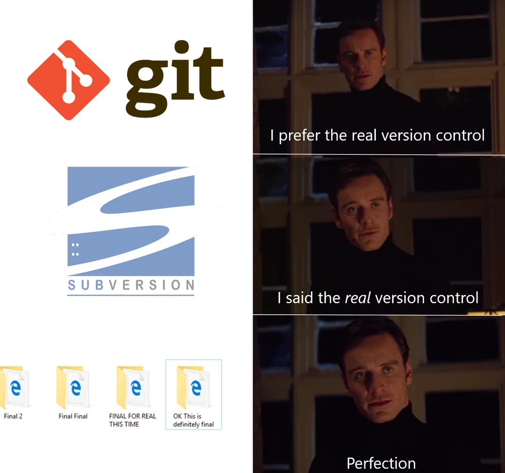

En el desarrollo de software, la colaboración y la gestión del código son aspectos clave. Cuando varias personas trabajan en un mismo proyecto o un desarrollador realiza cambios continuos a lo largo del tiempo, es esencial contar con una forma de rastrear y controlar esas modificaciones. Aquí es donde entran en juego los **sistemas de control de versiones (CVS)**.

## ¿Qué es un Sistema de Control de Versiones?
Un sistema de control de versiones (CVS) es una herramienta que permite llevar un registro detallado de todos los cambios realizados en un proyecto, especialmente en el código fuente. Con un CVS, es posible ver quién hizo qué cambio, cuándo lo hizo, y si es necesario, revertir a una versión anterior o fusionar cambios realizados por diferentes colaboradores.

Los CVS se utilizan para evitar problemas como:

- **Sobrescribir trabajo accidentalmente.** Cuando varios desarrolladores trabajan en los mismos archivos, es fácil que uno sobrescriba el trabajo de otro sin querer.
- **Dificultad para colaborar.** Sin un CVS, sería complicado integrar y coordinar las contribuciones de varios desarrolladores.
- **Falta de historial.** Sin un registro, sería difícil entender cómo y por qué se hicieron ciertos cambios en el proyecto.

## Tipos de Sistemas de Control de Versiones
Existen dos tipos principales de sistemas de control de versiones:

1. **Sistemas de Control de Versiones Centralizados (CCVS):** En este enfoque, el código fuente y su historial se almacenan en un servidor central. Los usuarios obtienen una copia del código desde el servidor, realizan cambios y luego los envían de vuelta. Ejemplos: Subversion (SVN), Perforce.

2. **Sistemas de Control de Versiones Distribuidos (DCVS):** En este modelo, cada colaborador tiene una copia completa del proyecto y su historial en su propia máquina. Esto permite trabajar sin conexión y realizar operaciones avanzadas de integración. Ejemplos: Git, Mercurial.
